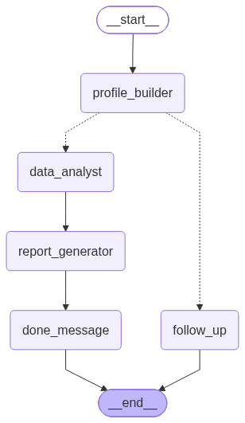

# Agent Graph Visualization

The multi-node chat agent can generate visual representations of its LangGraph structure for documentation and debugging purposes.

## Quick Start

### Generate visualization from Python

```python
from src.agents.chat import ChatAgent

agent = ChatAgent()

# Generate PNG (requires graphviz)
output_path = agent.visualize(output_dir="docs", filename="agent-graph.png")
print(f"Visualization saved to: {output_path}")

# Generate Mermaid markdown (fallback, always works)
output_path = agent.visualize(output_dir="docs", filename="agent-graph.md")
print(f"Visualization saved to: {output_path}")
```

### Generate visualization from CLI

```bash
# Use defaults (docs/agent-graph.png)
python scripts/visualize_agent_graph.py

# Specify custom output directory and filename
python scripts/visualize_agent_graph.py docs my-agent-diagram.png
python scripts/visualize_agent_graph.py . agent-flow.mermaid.md
```

## Visualization Function

The `_visualize()` function in `src/agents/chat/visualize.py`:

```python
def _visualize(
    graph,
    output_dir: str = "docs",
    filename: str = "agent-graph.png"
) -> str:
    """Generate and save a visual representation of the LangGraph.
    
    Args:
        graph: Compiled LangGraph or StateGraph
        output_dir: Directory to save visualization
        filename: Output filename
        
    Returns:
        Path to generated file
    """
```

### Behavior

- **PNG output** (`.png`): Renders graph using Mermaid → PNG conversion
  - Requires: `graphviz` system library, LangGraph's drawing utilities
  - **Best for**: presentations, documentation, static assets
  - **Fallback**: automatically switches to Mermaid markdown if PNG generation fails

- **Mermaid markdown** (`.md`): Saves raw Mermaid syntax
  - **Always works**: no external dependencies beyond LangGraph
  - **Best for**: version control, GitHub/GitLab rendering, markdown docs
  - **Auto-fallback**: PNG rendering failure → saves as `.mermaid.md` instead

## Output Examples

### PNG Output
- File: `docs/agent-graph.png`
- Contents: Binary PNG image showing node graph structure
- Open in: image viewer, browser, Markdown preview

### Mermaid Markdown Output
- File: `docs/agent-graph.mermaid.md` (or `.md`)
- Contents:
  ```mermaid
  graph TD
      START --> ProfileBuilder
      ProfileBuilder -->|complete| DataAnalyst
      ProfileBuilder -->|incomplete| END
      ...
  ```
- Open in: GitHub/GitLab (auto-renders), any Markdown viewer

## Graph Structure Visualized

The visualization shows:

1. **Nodes** (boxes)
   - `START`: entry point
   - `profile_builder`: Profile Builder SubAgent
   - `data_analyst`: Data Analyst SubAgent
   - `report_builder_llm`: Report Builder LLM SubAgent
   - `report_tools`: Report Tool Executor (non-SubAgent)
   - `finalize_report`: Finalize Report SubAgent
   - `END`: exit point

2. **Edges** (arrows)
   - Routing logic: conditional branches based on state
   - Loop-back: report_tools → report_builder_llm (bounded ReAct)
   - Tool execution: report_builder_llm tool call detection

3. **Color coding** (in PNG output)
   - Blue: SubAgent nodes (LLM-backed)
   - Orange: ToolNode / non-SubAgent nodes
   - Green: conditional routing decisions
   - Red: error/edge cases

## Troubleshooting

### PNG generation fails → automatic fallback to Mermaid markdown ✓

If you don't have `graphviz` installed, the function automatically falls back to saving Mermaid markdown instead:

```bash
# On macOS with Homebrew
brew install graphviz

# On Ubuntu/Debian
sudo apt-get install graphviz

# On Windows (Chocolatey)
choco install graphviz
```

### Mermaid markdown won't render in my viewer

- GitHub/GitLab: Mermaid rendering is built-in (use `.md` files in repo)
- VS Code: Install "Markdown Preview Mermaid Support" extension
- Notion/Obsidian: Copy the Mermaid code block and paste it directly
- Web: Use https://mermaid.live and paste the markdown content

### Graph looks wrong or incomplete

- **Node missing**: Check if all SubAgent subclasses are added to `_build_graph_structure()`
- **Edge missing**: Verify `add_edge()` and `add_conditional_edges()` calls in agent.py
- **State outdated**: Re-run visualization after code changes

## Integration with Docs

1. **Static documentation**: commit PNG to version control
   ```bash
   python scripts/visualize_agent_graph.py docs agent-graph.png
   git add docs/agent-graph.png
   git commit -m "docs: update agent graph visualization"
   ```

2. **Dynamic documentation**: embed Mermaid in markdown
   ```markdown
   # Agent Architecture
   
   
   
   Or (GitHub auto-renders Mermaid):
   
   ```mermaid
   [contents of agent-graph.mermaid.md]
   ```
   ```

3. **CI/CD integration**: auto-generate on every commit
   ```yaml
   # .github/workflows/docs.yml
   - name: Generate agent visualization
     run: python scripts/visualize_agent_graph.py docs agent-graph.png
   - name: Commit updated visualization
     run: git add docs/agent-graph.png && git commit -m "chore: update agent graph"
   ```

## Related Documentation

- [`docs/agent-architecture.md`](agent-architecture.md) — Manual Mermaid diagrams and design rationale
- [`src/agents/chat/graph_state.py`](../src/agents/chat/graph_state.py) — GraphState type definition
- [`src/agents/chat/agent.py`](../src/agents/chat/agent.py) — ChatAgent class and graph wiring
