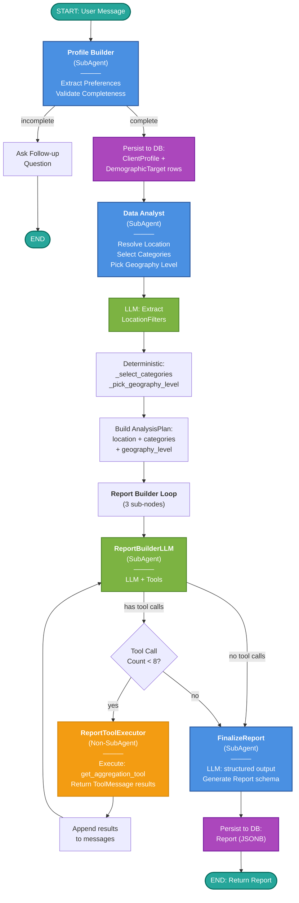
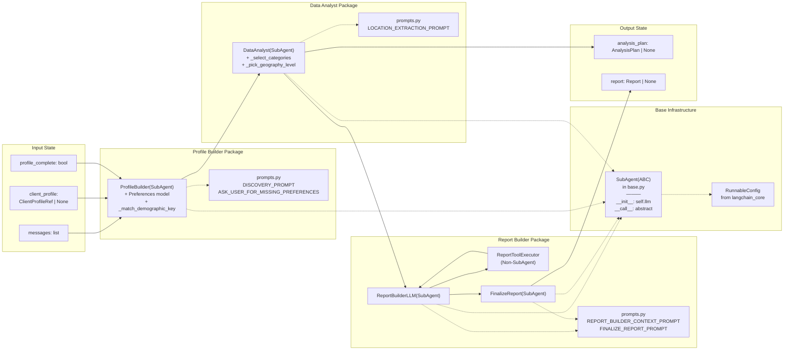
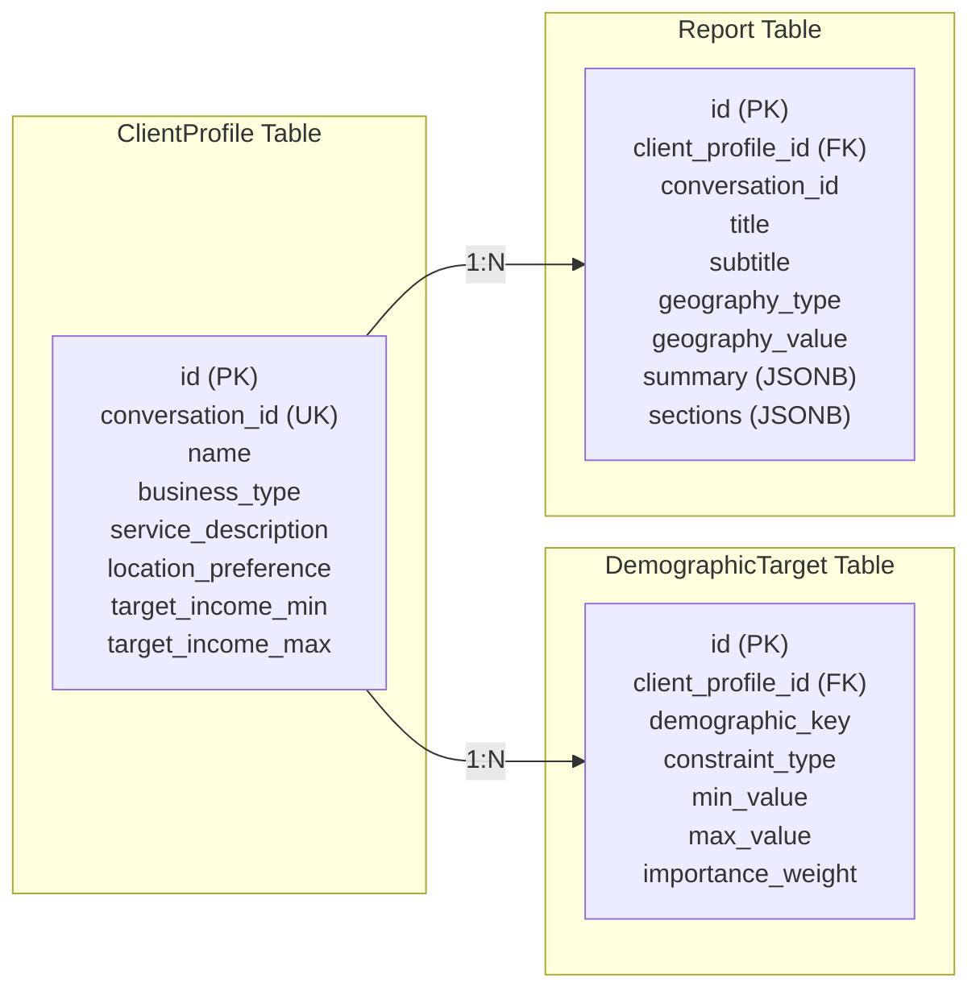
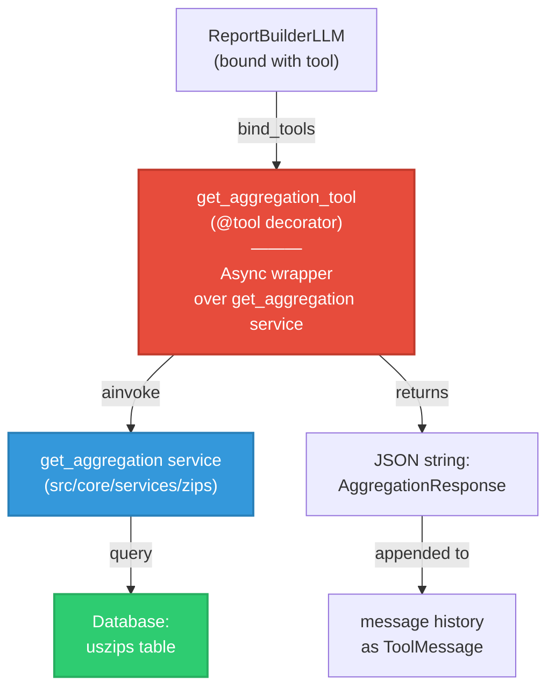

# Multi-Node Chat Agent Architecture

## System Flow Diagram

## State Flow & Package Structure

## Database Schema

## Tool Integration

## Key Design Decisions

| Aspect | Choice | Rationale |
|--------|--------|-----------|
| **Node Architecture** | SubAgent(ABC) base class | Eliminates LLM duplication; __call__ makes instances directly usable as LangGraph nodes |
| **Packaging** | Per-agent packages | Each agent owns its node, prompts, and helpers; clean separation of concerns |
| **Prompts** | Templates + .format() | No f-string reassembly in node bodies; prompts stay in prompts.py; readable call sites |
| **Bounded ReAct Loop** | 8-call safety cap | Prevents runaway LLM tool calls; deterministic completion path |
| **Report Storage** | JSONB (immutable) | No relational breakdown needed; reports are snapshots; fast queries without JOINs |
| **Profile Reload** | DB as source of truth | Checkpointer is authoritative for messages; DB is authoritative for committed profiles (guards against schema drift) |
| **Location Resolution** | Data Analyst node | Separates concerns: Profile Builder asks business questions; Data Analyst resolves geography for querying |

