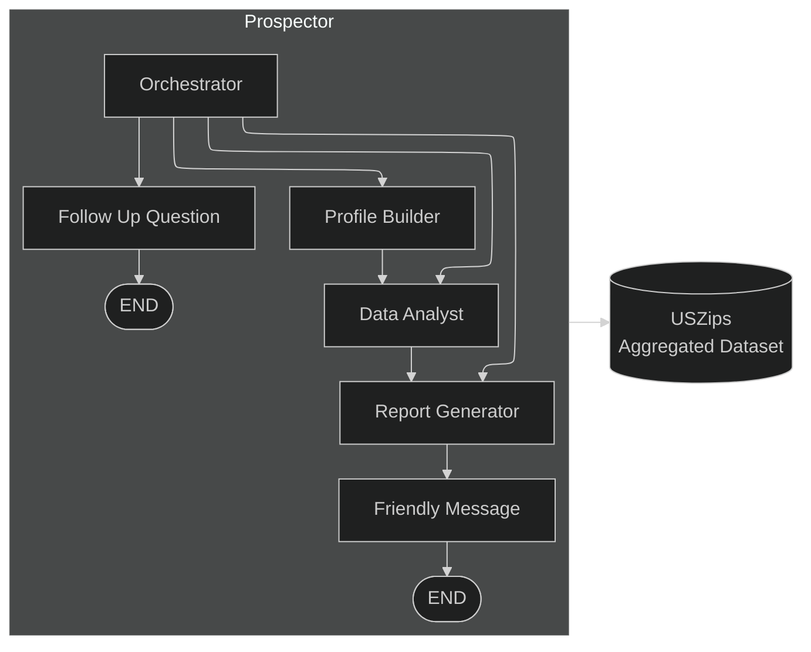

```mermaid
---
config:
  layout: elk
  theme: dark
---
flowchart LR
    subgraph Prospector["Prospector"]
        direction TD
        Orchestrator[Orchestrator]
        ProfileBuilder[Profile Builder]
        DataAnalyst[Data Analyst]
        ReportGenerator[Report Generator]
        FollowUp["Follow Up Question"]
        NiceMessage[Friendly Message]
        END1([END])
        END2([END])

        Orchestrator --> ProfileBuilder
        Orchestrator --> DataAnalyst
        Orchestrator --> ReportGenerator
        Orchestrator --> FollowUp
        FollowUp --> END1
        ProfileBuilder --> DataAnalyst
        DataAnalyst --> ReportGenerator
        ReportGenerator --> NiceMessage
        NiceMessage --> END2

        class Orchestrator orchestrate
        class ProfileBuilder,DataAnalyst,ReportGenerator process
        class FollowUp,NiceMessage decision
        class END1,END2 success
    end

    USZips[(USZips<br/>Aggregated Dataset)]

    Prospector --> USZips


    class Orchestrator orchestrate
    class ProfileBuilder,DataAnalyst,ReportGenerator process
    class FollowUp,NiceMessage decision
    class END1,END2 success
    class Prospector container
    class USZips database
```