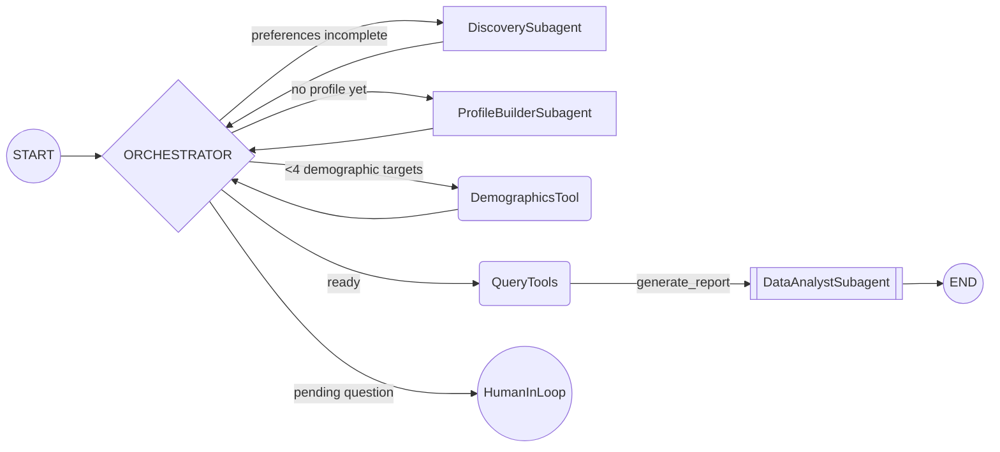
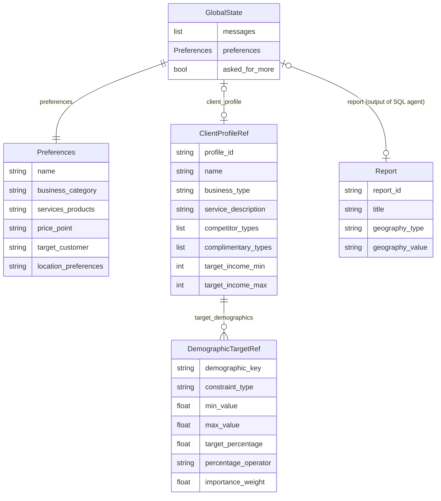
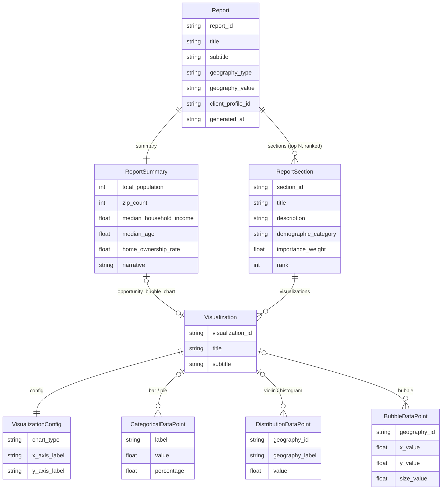
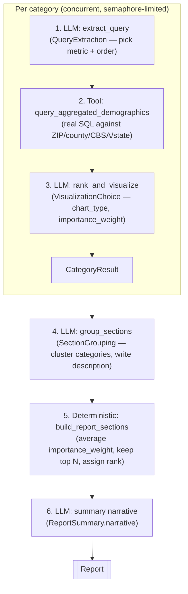

# Prospector — In-Class Presentation

---

## Section 1: Problem Statement / Why Agentic System?

### The problem

A franchise owner asks a question like:

> "I run Pink's Window Services, a home-services franchise based in Atlanta.
> Where within an hour of Atlanta should I open my next location?"

Answering this well requires:

1. Turning a vague business description into a concrete **ideal customer profile**
   (income band, age, competitor/complementary place types, etc.)
2. Translating that profile into **structured demographic targets** across up to
   11 Census-derived categories (income, age, race, education, housing, health,
   employment, marital status, community, language, transportation)
3. Running real **SQL aggregations** over ZIP/county/CBSA/state-level Census data
4. **Ranking** which of those metrics actually matter for this business
5. Choosing an appropriate **visualization** per metric and grouping related
   metrics into a coherent, narrated executive report

No single prompt reliably does all five. This is a multi-step, tool-using,
judgment-heavy workflow — not a text-completion task.

### Why an agentic system (not a script, not one LLM call)

| Requirement | Why it forces an agent |
|---|---|
| **Incomplete information up front** | The user rarely states all 6 required preferences in one message. The system must ask follow-up questions and resume — a *stateful, multi-turn* conversation, not a single call. |
| **Distinct specialized responsibilities** | Persona/profile building, demographic-target extraction, SQL querying, ranking, and narrative writing each need different prompts, tools, and structured outputs. Bundling them into one prompt collapses under complexity. |
| **Non-deterministic control flow** | The next step depends on what's already known ("is the profile complete?", "do we have >3 demographic targets?"). This is a routing problem, best expressed as a **graph**, not a linear script. |
| **Grounded, not hallucinated, data** | Demographic stats must come from real SQL queries against the ZIP-code database — the LLM proposes *which* query, tools execute it. |
| **Reliability at each step** | Every LLM output (preferences, demographic targets, query choice, visualization choice, section grouping) is constrained to a **Pydantic schema**, so failures are caught immediately instead of propagating as bad data. |
| **Long-running & resumable** | A user may leave and come back. LangGraph's checkpointer persists `GlobalState` per `thread_id` (Postgres-backed) so the conversation picks up exactly where it left off. |

**In short:** the task decomposes naturally into a graph of specialized nodes,
each with its own tools and schema, coordinated by shared, persisted state —
that combination is what "agentic system" means here.

---

## Section 2: System Design

### 2.1 Two-agent architecture

- **Orchestrator** (`src/agents/orchestrator/agent.py`) — the conversational
  agent. Owns `GlobalState`, drives discovery, profile building, and
  demographic-target extraction, then hands off to the SQL agent.
- **SQL Analyst** (`src/agents/sql_analyst/agent.py`) — a report-generation
  subroutine invoked from the orchestrator's `query_node`. Not itself a
  StateGraph — a straight-line async pipeline (see 2.3), since its steps
  always run in the same order.

### Artifact: GlobalState ERD

`GlobalState` (`src/agents/orchestrator/agent.py:161`) is the `TypedDict`
shared across every orchestrator node, checkpointed per conversation thread.

Key design point: `ClientProfileRef` / `DemographicTargetRef` are
**serializable Pydantic mirrors** of the SQLAlchemy/SQLModel ORM rows
(`ClientProfile`, `DemographicTarget` in `src/core/database/models/`). LangGraph
state must be checkpoint-safe — passing live ORM objects through state risks
`DetachedInstanceError` once the originating session closes (see
`CLAUDE.md`). The orchestrator writes to the DB, then converts the result to
a `Ref` model before putting it back into `GlobalState`.

### Artifact: Report ERD

`Report` (`src/schemas/report.py`) is the structured output of the SQL agent,
consumed by the D3.js frontend.

Key design point: `Visualization` is a **discriminated-by-`chart_type`**
model — exactly one of `categorical_data` / `distribution_data` /
`bubble_data` is populated. This lets one Pydantic model serve every chart
type the frontend needs to render, instead of a model per chart.

### 2.2 Why these particular models

- **`ReportSection.importance_weight`** is deterministic, not LLM-guessed —
  it's the average of its visualizations' LLM-assigned weights
  (`build_report_sections`, `src/agents/sql_analyst/agent.py:711`). Only the
  top N sections survive. This keeps ranking reproducible while still letting
  the LLM judge relevance per metric.
- **`DemographicTargetRef` / `DemographicTarget`** exist in two forms
  (Pydantic state ref vs. SQLModel table row) for the same reason as
  `ClientProfileRef` above — state needs to survive a closed DB session.

### 2.3 SQL Agent pipeline

Derived from `src/agents/orchestrator/sql_agent_pseudocode.md`, implemented
in `src/agents/sql_analyst/agent.py`. For each of up to 11 demographic
categories (`select_categories` narrows this to the categories implied by
the client's targets, padded to a minimum of 5 for report depth):

Matches the pseudocode's four core steps:

1. **Extract the most useful query** per category given client preferences
   (LLM + query tools) → `QueryExtraction`
2. **Rank usefulness** via `importance_weight` on the resulting
   `VisualizationChoice`
3. **Pick a visualization** and convert data into the `Visualization` response
   model (`build_visualization`)
4. **Group into sections**, average `importance_weight`, keep the top N
   (`build_report_sections`) — the LLM explains *why* a grouping is useful in
   `ReportSection.description`

Every query-tool call is logged (`src/core/logging.py` `timed()` /
structured logs) for observability into query success rate, per the coding
standards in the pseudocode doc.

---

## Section 3: Evaluation

### 3.1 Methodology

The eval harness (`evals/run_eval.py`, run via `just eval`) drives **15 fictitious
businesses** (`evals/dataset/`) end-to-end through the full agentic path —
`Orchestrator.chat()` with a single complete business brief — and measures four
metrics per report. Results are written incrementally (one report at a time to
`evals/results/<business_id>/`), so a mid-run failure loses nothing and reruns
resume where they left off.

| Metric | How it's measured |
|---|---|
| **Latency** | Wall-clock per report, plus per-stage timings parsed from the `timed()` log lines (e.g. `llm:income.extract`, `node:query_node.generate_report`). |
| **Token usage** | `get_usage_metadata_callback()` (contextvar-based) wraps the whole run, capturing every nested LLM call — orchestrator nodes *and* the SQL agent's concurrent category tasks. |
| **Tool selection accuracy** | Parsed from the SQL agent's own logs: was the LLM-chosen metric a valid key on the first try (vs. rescued by `resolve_metric_name` or unresolvable), and did the resulting query return rows? |
| **Report quality** | **LLM-as-judge** (`evals/judge.py`): one structured-output call scoring 6 rubric dimensions 1–10 (overall, section relevance, narrative, data plausibility, visualization fit, tool-selection relevance) against the business brief. Plus a **`human_report_quality: null`** field in every `metrics.json` for manual human review. |

### 3.2 Results (n = 15; 14 completed, 1 hard failure)

| Aggregate | Value |
|---|---|
| Latency (mean / median) | **70.3s / 72.8s** per report (range 43.6–86.8s) |
| Tokens per report (mean) | **~29.8K** total (22.7K input / 7.1K output) |
| Metric valid on first try | **100%** (`resolve_metric_name` rescue never needed) |
| Query success rate | **79%** (3 runs produced 0-section reports — see findings) |
| Judge: overall quality | **4.6 / 10** (5.2 among the 11 fully-populated reports) |
| Judge: tool-selection relevance | **6.3 / 10** |
| Judge: section relevance / viz fit | **6.1 / 6.0 / 10** |
| Judge: narrative / data plausibility | **4.6 / 4.9 / 10** |
| Human review | *pending — fill `human_report_quality` in each `evals/results/*/metrics.json`* |

### 3.3 What the eval surfaced (real bugs, found automatically)

1. **CBSA name-resolution ambiguity** — "Portland, Oregon" resolved to
   *Portland-South Portland, ME* and "Charleston, South Carolina" to
   *Charleston-Mattoon, IL*. Both runs produced 0-section reports scored 2–3/10
   by the judge. The state hint in the brief is being dropped during CBSA lookup.
2. **Region-scope queries return 0 rows** — the "Midwest region" business got
   population totals (69M) but every category query came back empty.
3. **Structured-output fragility** — one business (multi-state NY/NJ/CT tutoring)
   failed twice with the same Pydantic validation error: the LLM returns
   `SummaryNarrative.top_opportunities` as a tagged string instead of a list.
   A second, transient variant of this hit `SectionGroupingResponse` once
   (succeeded on retry).
4. **Judge's top qualitative critique** — county-level aggregation is too coarse
   for briefs that ask for a *walkable neighborhood*; reports never drill to
   ZIP granularity, capping overall usefulness scores at ~5 even when metric
   selection was good (data plausibility also flagged cross-chart
   inconsistencies for the same county).

### 3.4 Takeaways & limitations

- The **mechanical pipeline is reliable** (100% first-try metric validity, no
  query syntax failures); the weak spots are *geographic entity resolution* and
  *output-schema robustness* — both fixable, and both invisible without an eval.
- Judge scores are from a single strict LLM judge (same model family as the
  agent — self-preference bias is possible) with n=15; the human-review column
  exists precisely to calibrate the judge before trusting it as a regression
  gate.
- Reproduce with `just eval` (resumes), `just eval-one <id>`, or
  `just eval-force`; per-run artifacts live in `evals/results/`
  (`report.json`, `metrics.json`, `summary.csv`).
