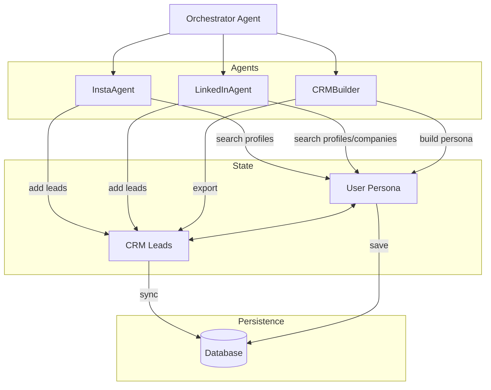

# Prospector Multi-Agent System Design

```mermaid
flowchart TB
    O[Orchestrator Agent]

    subgraph Agents
        IA[InstaAgent]
        LA[LinkedInAgent]
        CRM[CRMBuilder]
    end

    O --> IA
    O --> LA
    O --> CRM

    subgraph State
        UP[User Persona]
        CRMData[CRM Leads]
    end

    IA --> |search profiles| UP
    IA --> |add leads| CRMData

    LA --> |search profiles/companies| UP
    LA --> |add leads| CRMData

    CRM --> |build persona| UP
    CRM --> |export| CRMData

    UP <--> CRMData

    subgraph Persistence
        DB[(Database)]
    end

    CRMData --> |sync| DB
    UP --> |save| DB
```
